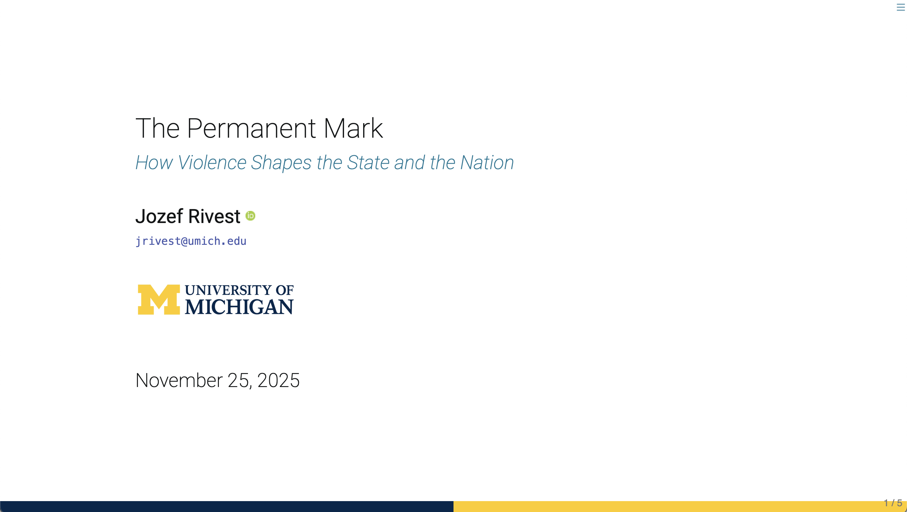

# University of Michigan Reveal Quarto Template

Initially copied from Grant McDermott and Kyle Butt's clean theme, published under MIT license.

[https://github.com/grantmcdermott/quarto-revealjs-clean](https://github.com/grantmcdermott/quarto-revealjs-clean)

Click the screenshot below to be taken to a
[live demo](https://jozefrivest.com/quarto-revealjs-clean-demo/template.html).

[]

<!--(https://jozefrivest.com/quarto-revealjs-clean-demo/template.html)-->

## Use

Depending on your use case, here are some [Quarto CLI](https://quarto.org/)
commands to get started.

If you would like to add the **clean** theme to an existing directory:

```bash
quarto install extension JozefRivest/quarto-revealjs-clean
```

